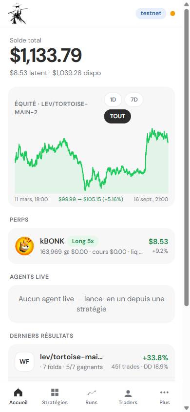
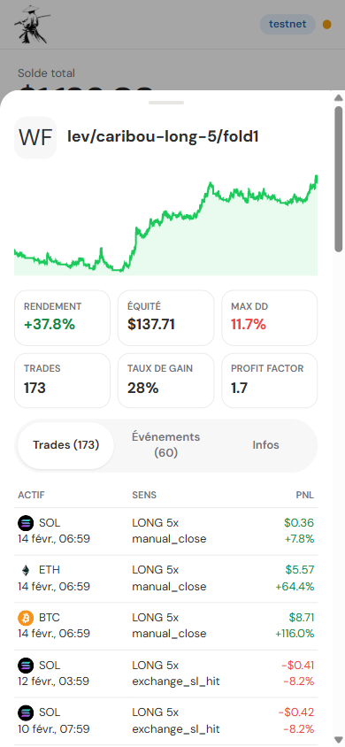
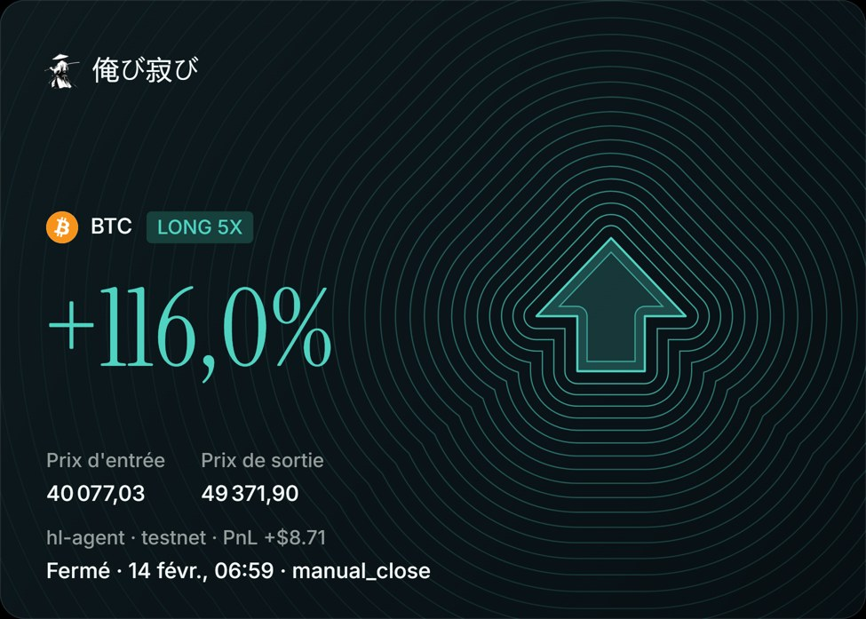

# hl-agent

[](https://github.com/DonDevv/hl-agent/actions/workflows/ci.yml)


[](LICENSE)

An autonomous, risk-managed perpetuals trading agent for [Hyperliquid](https://hyperliquid.xyz),
with a backtester that runs **the exact same engine** as live trading, and a phone-first
dashboard to operate it from a VPS.

> **Status: experimental, running on Hyperliquid testnet.** Nothing here is financial
> advice and no strategy in this repository has a proven edge — see
> [Results and limits](#results-and-limits). Use real funds at your own risk.

<p align="center">
  
  
  
</p>

## What it does

- **One engine, two venues.** Sizing, guard rails, exit ladders and de-duplication are pure
  functions over a small state; the only thing that changes between a backtest and a live
  run is the `Broker` / `MarketView` implementation behind a port. A strategy that
  backtests is the strategy that trades.
- **Senpi-compatible strategy contract.** A package is `runtime.yaml` + `scanners/scan.py`
  exposing `scan(inputs, ctx)`; recipes from the
  [Senpi catalog](https://github.com/senpi-ai/senpi-skills) load unmodified (the test suite
  loads all 100+ of them). Scanners run in a subprocess with a bounded state store and a
  read-only MCP shim: they can look at the market, never at the wallet.
- **Risk first.** Stops live on the exchange, not in the process. Guard rails: daily loss
  limit, max entries per day, losing-streak cooldown, drawdown halt, per-asset cooldown,
  leverage and notional caps, and an **L2 liquidity gate** (max spread + minimum resting
  depth on the exit side, so a stop-market fills near its trigger). A `STOP` file is the
  kill switch: the runner flattens on its next tick.
- **Backtest, walk-forward, live.** Candle cache in Parquet (Hyperliquid first, Binance
  USDT-perp backfill for older history), simulated broker with fees and slippage, k-fold
  walk-forward, metrics and reports from the same `events.jsonl` the live runner writes.
- **Copy-trading.** Leaderboard discovery and a mirror source that copies another
  address's *allocation* (not its stops) under your own exit ladder and rails.
- **Operable from a phone.** FastAPI + vanilla-JS PWA: balance and equity curve, live
  agents with Stop, strategies with one-tap validate/backtest/walk-forward/go-live, run
  detail with trades and events, jobs with log tails, and a canvas-rendered share card.
  Deployed with systemd behind Tailscale, no port exposed.

## Architecture

```
src/hl_agent/
  data/        Hyperliquid read API, typed models, Parquet candle cache, Binance backfill
  strategy/    scan(inputs, ctx) contract, package loader, bounded state store, MCP shim
  engine/      sizing · guard rails · liquidity gate · exit DSL · dedup · step loop  (pure)
  execution/   Broker + MarketView ports: simulated (backtest) and Hyperliquid (live)
  copy/        leaderboard discovery and the mirror signal source
  telemetry/   event log, metrics, reports
  web/         FastAPI API + PWA, job registry (whitelisted CLI subprocesses)
  cli.py       fetch · validate · backtest · walkforward · run · stop · report · status · web
strategies/    caribou-degen · compass · pendulum (Senpi-format packages, see NOTICE)
deploy/        systemd units + Tailscale recipe for a small VPS
tests/         pytest, fixtures are recorded Hyperliquid payloads; no network in CI
```

```
          scanners (subprocess)          engine (pure)                 venue
 candles ─► scan(inputs, ctx) ─► signals ─► gates ─► plan ─► orders ─► Broker ─► Hyperliquid
                                             ▲                            │        or sim
                                    GuardRailState ◄── fills / equity ◄───┘
```

Design decisions worth reading in the code:

- [`engine/guardrails.py`](src/hl_agent/engine/guardrails.py) — every rejection carries a
  reason code, so the event log explains *why* a signal did not trade.
- [`engine/loop.py`](src/hl_agent/engine/loop.py) — one `step()` per tick, no I/O; the
  live runner and the backtester both call it.
- [`execution/live.py`](src/hl_agent/execution/live.py) — exchange-side stops, exponential
  backoff on venue/network errors (the runner survived a 40-minute DNS outage), fail-closed
  when the account cannot be read.
- [`web/jobs.py`](src/hl_agent/web/jobs.py) — the dashboard never passes raw arguments to
  the CLI; each job kind has a whitelisted argv builder.

## Quick start

```bash
python -m venv .venv && .venv/Scripts/pip install -e ".[dev,web]"     # or bin/ on Linux
cp config/settings.example.toml config/settings.toml                   # network, address, risk caps

hl-agent fetch --assets BTC ETH SOL --intervals 1h 4h 1d --since 2024-01-01
hl-agent validate strategies/compass                     # dry-run every scanner
hl-agent backtest strategies/compass --start 2026-04-01 --out compass-q2
hl-agent walkforward strategies/compass --folds 3
hl-agent report compass-q2 --json                        # metrics from runs/compass-q2
hl-agent web                                             # dashboard on http://127.0.0.1:8080
```

Live (testnet by default; mainnet needs `[network] name = "mainnet"` **and**
`--i-accept-real-money`):

```bash
export HL_AGENT_PRIVATE_KEY=0x...      # agent-wallet key, env only, never written to disk
hl-agent status
hl-agent run strategies/caribou-degen --name live --interval 60
hl-agent stop live                     # kill switch
```

Every run directory (`runs/<name>/`) holds `events.jsonl`, `equity.jsonl` and, for
backtests, `metrics.json` — the dashboard and `report` read nothing else.

## Results and limits

Honest version. After one day live on testnet with `caribou-degen` (long-only trend
sleeve, 5× max leverage): 8 trades, 3 wins / 5 losses, profit factor 1.8, +14 % on a
999 $ account — of which a single ARB trade at +130 % ROE is most of the gain.

That is **not** evidence of an edge:

- the sample is tiny; the plan is 4–6 weeks and ≥60 trades on testnet before any real
  money, with a profit factor > 1.3 *after* fees and funding and a max drawdown < 15 %;
- testnet books are thin, so stop-market exits slip more than on mainnet (the liquidity
  gate came out of a post-mortem on exactly that);
- the strategy is trend-following and long-only: it is regime-dependent and its positions
  are correlated;
- backtests use Hyperliquid + Binance candles and a simple fee/slippage model, not the L2
  book.

What the project *does* show is the plumbing needed to find out safely: the same code path
in backtest and live, auditable rejections, exchange-side stops, a kill switch, and a
dashboard that makes a running agent legible from a phone.

## Development

```bash
.venv/Scripts/pytest -p no:warnings        # ~170 tests, offline
.venv/Scripts/ruff check src tests && .venv/Scripts/ruff format --check src tests
.venv/Scripts/mypy                         # strict
```

`SENPI_STRATEGIES=/path/to/senpi-skills/strategies` enables the catalog-wide loader tests.
Static dashboard assets are cache-busted with `?v=N` and the service-worker cache name:
bump both when you change them.

## Deployment

`deploy/README.md` covers the VPS recipe: a dedicated user, two systemd units (agent and
dashboard), secrets in `/etc/hl-agent/env`, and Tailscale Serve for HTTPS on the tailnet
only. The dashboard is a PWA: on iOS, Share → Add to Home Screen.

## License

MIT — see [LICENSE](LICENSE). The bundled strategy packages derive from Senpi's MIT-licensed
catalog; attribution in [NOTICE](NOTICE).
